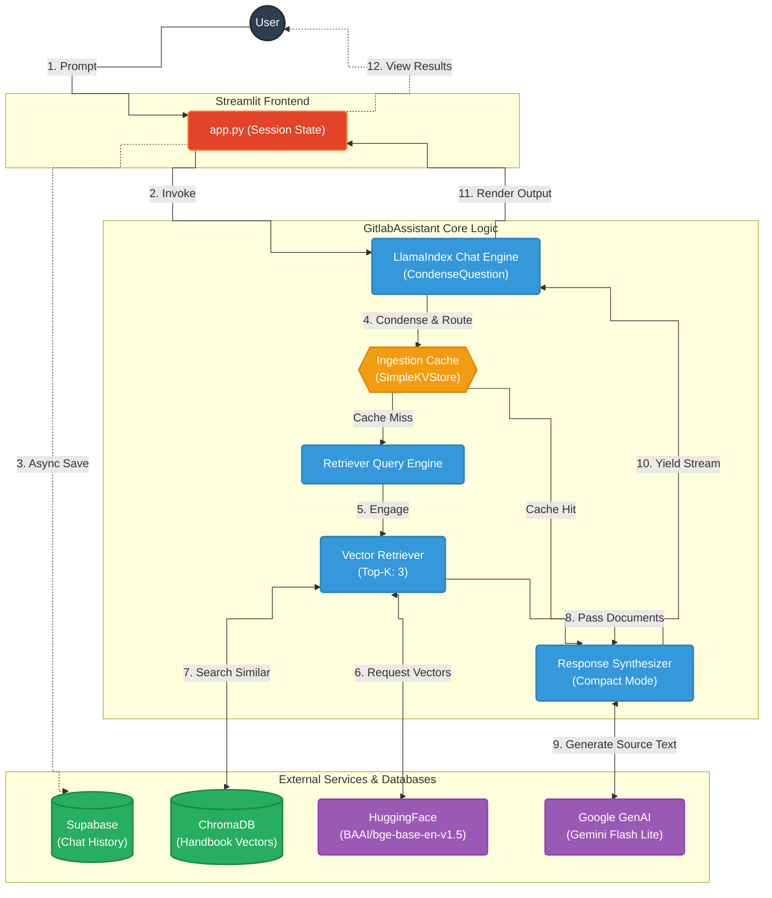

# GitLab Handbook GenAI Chatbot 🦊

This repository contains a full-stack, transparent Generative AI chatbot built for GitLab employees and aspiring candidates. It interacts directly with the GitLab Handbook and Direction pages, retrieving context natively to prevent LLM hallucinations.

## Key Features

- **Crawl4AI Data Pipeline:** Fast, intelligent markdown scraping.
- **Google GenAI LLM & HuggingFace Embeddings:** Built with Gemini Flash Lite and BAAI/bge-base embeddings via LlamaIndex.
- **Retrieval Engine & ChromaDB:** Vectorized search persistence using ChromaDB.
- **Embedding Caching & Supabase:** In-memory caching for faster responses and Supabase integration to persist user chat history.
- **Strict Guardrails:** Configured LlamaIndex `PromptTemplates` restrict responses to retrieved handbook context exclusively.
- **Radical Transparency UX:** The UI visibly displays the confidence score & exact sources for every response generated.

## System Architecture

The GitLab Handbook GenAI Chatbot uses a Retrieval-Augmented Generation (RAG) architecture. It relies on a local ChromaDB vector store populated with data scraped from the GitLab Handbook. When a user asks a question, the system retrieves the most relevant handbook sections using dense vector search, caches repetitive queries to ensure high throughput, and prompts the Google Gemini model to construct a response strictly based on those verified sources.

The following diagram illustrates the data flow from the Streamlit UI through the caching and vector-retrieval layers, finally generating responses via Google GenAI.



## Local Setup

### Prerequisites

- Python 3.9+
- A Google AI Studio API Key (Gemini)

### Installation

1. Clone the repository:
   ```bash
   git clone https://github.com/yourusername/gitlab-genai-chatbot.git
   cd gitlab-genai-chatbot
   ```
2. Create and activate a Virtual Environment
   ```bash
   python -m venv venv
   source venv/bin/activate # Windows: venv\Scripts\activate
   ```
3. Install dependencies:
   ```bash
   pip install -r requirements.txt
   ```
4. Configure `.env` file:
   Retrieve your API key from Google AI Studio and place it in the `.env` file.

   ```
   GOOGLE_API_KEY=your_key_here
   GOOGLE_LLM_MODEL=gemini-2.0-flash
   GOOGLE_EMBED_MODEL=gemini-embedding-001

   # Supabase Configuration (Optional for Chat History)
   SUPABASE_URL=your_supabase_url
   SUPABASE_KEY=your_supabase_anon_key
   ```

   To use Chroma Cloud instead of the local persistent database, also set:

   ```
   CHROMA_HOST=api.trychroma.com
   CHROMA_TENANT=your_tenant_id
   CHROMA_DATABASE=your_database_name
   CHROMA_API_KEY=your_chroma_api_key
   ```

### Running the Application

**Step 1:** Ingest Data
Before running the bot, populate the local ChromaDB database by running the crawl script:

```bash
python src/ingest_data.py
```

_(Note: Initial ingestion may take several minutes depending on the quantity of crawled pages. If you use Chroma Cloud, the app now connects through the official cloud client path.)_

**Step 2:** Start the Streamlit Application

```bash
streamlit run app.py
```

## Deployment

This app handles Streamlit Community Cloud out-of-the-box.

1. Push this repository to GitHub.
2. Go to Steamlit Community Cloud and link this repo (`app.py` as entrypoint).
3. Insert `GOOGLE_API_KEY` into Streamlit's secrets manager.
